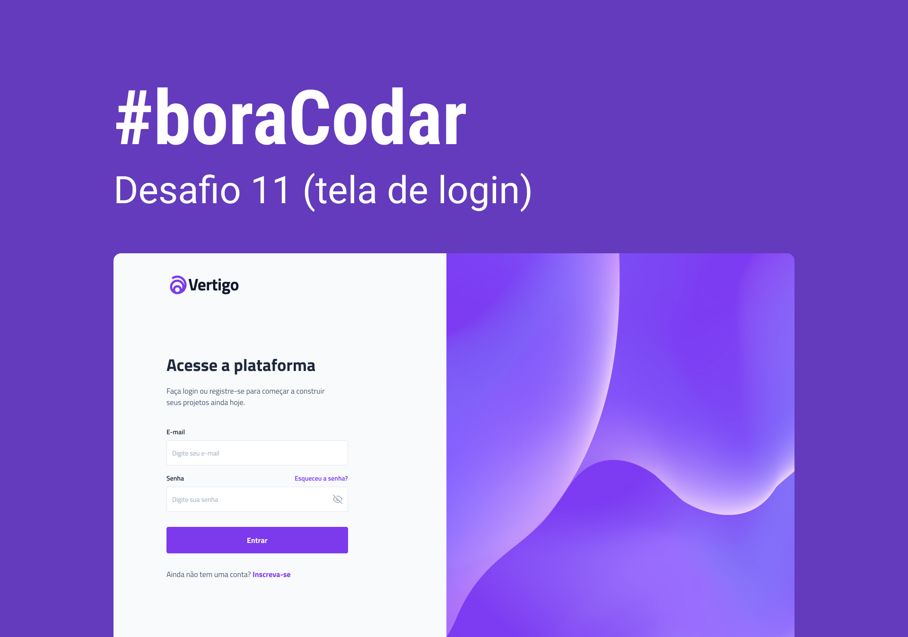

<h1 align="center"> Tela de Login | Vertigo </h1>

Projeto desenvolvido durante o desafio 11 do   
<a href="https://www.rocketseat.com.br/boracodar" target="_blank">#boraCodar</a>, utilizando um layout feito pelo <a href="https://www.linkedin.com/in/jonas-milan-8b68b3b2/" target="_blank">Jonas Milan</a>,   o desafio foi promovido pela <a href="https://www.rocketseat.com.br" target="_blank">Rocketseat</a>  

  <a href="#-tecnologias">Tecnologias</a>&nbsp;&nbsp;&nbsp;|&nbsp;&nbsp;&nbsp;
  <a href="#-projeto">Projeto</a>&nbsp;&nbsp;&nbsp;|&nbsp;&nbsp;&nbsp;
  <a href="#-layout">Layout</a>&nbsp;&nbsp;&nbsp;|&nbsp;&nbsp;&nbsp;
  

 

  

## 🚀 Tecnologias

Esse projeto foi desenvolvido utilizando as tecnologias:

- HTML e CSS
- Git e Github
- Figma

## 💻 Projeto

O projeto simula uma tela de login de uma plataforma de projetos.
 
 
(Precisa de algumas alterações que serão feitas em breve, como o error e disable nos inputs, responsividade e mais algumas lapidadas pra deixar o projeto perfeito)

- <a href="https://hecro.github.io/vertigo-login-page/">Você pode acessá-lo clicando aqui</a> ou clicando no link no topo desse mesmo repositório.

## 🔖 Layout

Você pode visualizar o layout [clicando aqui](https://www.figma.com/community/file/1217810469465160264). Você vai precisar de uma conta no [Figma](https://figma.com) para acessar.

---

Feito com 💜 by Lucas Hecro
